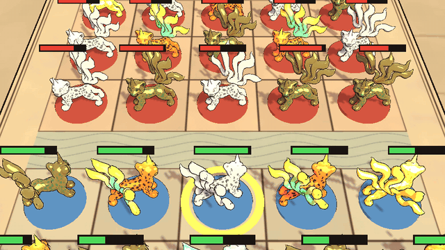
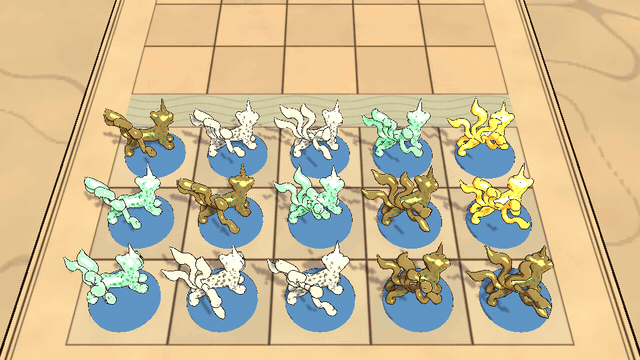
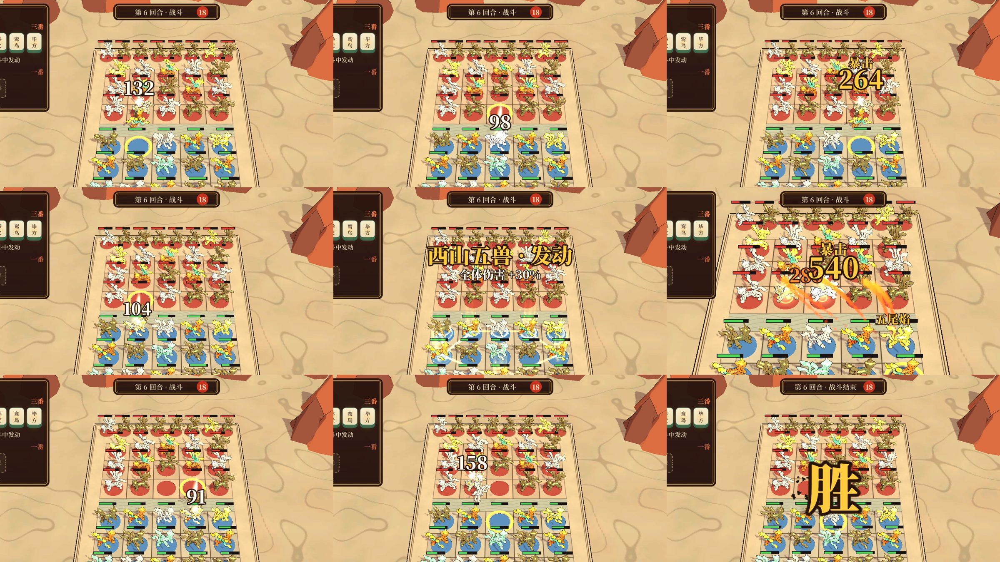

# 特效验证（08 §1）：战法特效 + 胡牌成型特效

生成：`unity run client -- -executeMethod Automatic.Editor.Batch.FxSlice`，然后运行 `python tools/art/fx_media.py`，把序列帧转成 GIF 和拼图。

- 脚本：`FxAssets.cs` 生成遮罩贴图、材质和网格，`FxPrefabs.cs` 生成粒子预制体，`FxSlice.cs` 在棋盘场景里按时间轴同时播放动作和粒子，逐帧渲染。都在 `client/Assets/Editor/`。
- 资源：`client/Assets/HotRes/Art/Fx/`，热更资源目录。着色器是 `HotRes/Shaders/Fx.shader`（`Relics/Fx`）。
- 预制体上**没有任何脚本**，只有粒子系统，所以换特效只需要发资源包。
- 粒子由脚本手动步进（`ParticleSystem.Simulate`），每次运行结果相同，无头模式也能跑。
- 每个序列渲染两个镜头：`*_board.gif` 是战斗镜头，整张桌面都在画面里，用来验可读性；`*_close.gif` 是推近镜头，用来看特效细节。`*_sheet.png` 是推近镜头的 12 张关键帧。

## 1. 战法特效：狰「五尾焰」

| 时间 | 施法者（`cast` 动作） | 特效 |
|---|---|---|
| 0–0.5 s | 后坐、立起，五尾张开 | `fx_zheng_charge`：脚下法阵旋转，火星向胸口聚拢，核心光球变大 |
| 0.5 s | 放出 | 5 个 `fx_zheng_bolt` 从五条尾巴的尾尖出发，每条间隔 0.03 秒，沿扇形弧线飞行 0.35 秒 |
| 0.85 s | 目标播放 `hit` | `fx_zheng_impact`：闪光、火球、火花、地面冲击环，然后是烟和余烬 |
| 约 2.0 s | 回到待机 | 烟散尽 |

- 「一条尾巴一道火」是这个特效的辨识点，出发位置直接读尾骨 `tail{1..5}.4` 的位置。
- 弧线由表现层计算，预制体只管自身外观。接入战斗时：`charge` 放在施法者脚下，`bolt` 由表现层移动，`impact` 放在目标脚下。命中时刻要和逻辑里的伤害 tick 对齐（01 §3.1）。

## 2. 胡牌成型特效

场景按准备阶段布置：只显示己方，不显示血条和行动金环，所有棋子都是器物静止态（`awaken` 的第 0 帧）。示例牌型是 5 只棋子，围成一圈。

| 时间 | 演出 |
|---|---|
| 0.15 s 起，每 0.12 s 一只 | 像麻将亮牌一样逐个点亮：`fx_hu_piece`（光柱冲起、闪光、地面光环、上升光点），同时这只棋子播放 `awaken`，活过来 |
| 每点亮一只 | `fx_hu_link`：一串光点把它和上一只连起来，最后一只再连回第一只，在棋盘上画出牌型的形状 |
| 0.78 s | `fx_hu_seal`：在牌型中心盖下一个铜镜纹「山海印」（TLV 博局纹），两道冲击环扩散，光点升起 |
| 约 2.6 s | 结束，成型的棋子进入待机 |

- `fx_hu_link` 的接法：根节点放在两只棋子的中点，本地 X 轴沿连线方向，`localScale.x` 设为连线长度。只缩放发射形状，粒子大小不变。
- 演出长度约 2.6 秒。准备阶段的胡牌不占用战斗时间轴；战斗中的「发动」（`HandTriggered`）如果也要演出，停顿时间必须写进逻辑时间轴（01 §3.1、06 §2）。

## 3. 结论

**可读性**
- 胡牌：在战斗镜头下也很清楚（`hu_board.gif`）。光柱标出哪几只成型，连线画出牌型形状，这两层最有效。
- 胡牌的山海印在桌面上偏淡，大部分被棋子挡住。牌型名称和「胡」字更适合放进 §3 的 UI 演出里，场景里的印只起辅助作用。
- 战法：推近镜头下五道火焰分得清。整桌镜头下能看出「一团火从这边飞到那边，炸开」，但看不清五道。这可以接受，因为战斗中允许有限推镜（04 §2）。
- 施法法阵和行动金环叠在同一个位置，以后可以考虑合并成一个。

**踩过的坑**
- 纯叠加（additive）发光在浅色的羊皮纸桌面上会变成一片白，看不出火和金的颜色。
- 现在 `Relics/Fx` 用预乘 alpha 加一个 `_Opacity` 参数：0 是纯叠加，1 是普通半透明。火焰用 0.7，光晕用 0.35，烟用 1。
- 所有特效材质共用同一个着色器和同一个混合状态，对合批友好。

**性能（静态数据，没有实测）**
- 战法：同时 7 个特效实例、24 个粒子系统，峰值 353 个粒子。
- 胡牌：11 个实例、30 个粒子系统，峰值 551 个粒子。
- 贴图：5 张单通道遮罩，最大一张 512²（印）。材质 6 个。
- 下一步做移动端测试时要实测透明区域的重复绘制，胡牌的光柱和印的面积都比较大。

**成本**
- 全部由脚本程序化生成，没有外部费用，也没有美术工时。
- 后续正式美术可以替换遮罩贴图和颜色，预制体结构和接入约定（挂点、时间轴）不用变。

**还没做**
- 运行时接入：战斗表现层生成特效、移动火焰、按事件触发。
- 和 §3 商店 UI 的胡牌演出联动。

**待定的设计问题**
- 这次演出让成型的棋子「活过来」，其他棋子仍是器物静止态，效果很好，「谁成型了」一眼就能看出来。
- 但这和「战斗中是否全部活过来」那个待定问题有关：如果战斗里所有棋子都会活过来，胡牌时的觉醒就不再特别。一个可以考虑的方案：**只有成型（胡牌）的棋子才活过来**，没成型的棋子在战斗里也保持器物态。

## 4. 战斗演出切片（2026-10-07）

可玩 Demo（`Relics.exe`）在开战过渡之后，接着播一段约 16 秒的脚本战斗。上图每格依次是：每次出手命中的瞬间、牌型发动、大招命中、胜利。

- 用 `client/Assets/HotUpdate/Game/BattleScript.cs` 手写了一份战斗事件流，代替核心将来输出的事件流（03 §8）。双方轮流行动，每个行动的时长固定。
- `BattleShow.cs` 负责把事件流演出来，`BattlePops.cs` 负责伤害数字、技能名和横幅。三个都是热更代码。
- 新特效由 `client/Assets/Editor/FxBattle.cs` 生成，随 `Batch.FxSlice` 一起出。粒子通用的辅助函数拆到了 `FxKit.cs`。

| 行动 | 时长 | 演出 |
|---|---|---|
| 普攻 | 1.6 s | 行动金环移到出手者；扑跃 0.4 s 到目标面前（起跳和落地带尘土）；攻击动作 0.8 s，0.34 s 时命中；扑跃回原位，转回原来的朝向 |
| 战法「五尾焰」 | 2.7 s | 施法者头上冒出技能名；镜头 0.45 s 推近到施法者和目标之间（距离缩短 30%）；蓄力，0.5 s 时五条尾巴各放一道火（2 / 1 / 2 分给三个目标）；命中后停 0.55 s，镜头拉回 |
| 牌型发动 | 2.5 s | 屏幕中间出横幅「西山五兽 · 发动 / 全体伤害 +30%」；成型的 5 只依次在光柱里跳起，连线重画牌型形状；从牌型中心向外，给己方棋盘上每只棋子加增益光环 |
| 每次命中 | — | 顿帧 0.06 s（暴击和战法 0.11 s）、震屏、白色边缘光闪 0.09 s、压扁回弹、伤害数字 |
| 阵亡 | — | 死亡动作，0.8 s 后碎裂：碎片用这只棋子自己的材质，在桌面上弹跳，同时扬起尘土；血条消失，底座留在原地 |

**伤害数字**（04 §1.4）
- 普攻是白字，战法是橙字。暴击用金色大字，上面加一行「暴击」，位置抬高一层，避免和同一招打到的相邻目标的数字重叠。
- 都用深褐色粗描边：标题字体的 underlay，不偏移，加粗 0.8。
- 第一版没有描边，在浅色桌面上看不清。原因是拿错了材质：「胡」字的材质没开 underlay，牌型名横幅的材质（`ui_title_shadow`）才开了。改用后者，壳里本来就有这个着色器变体。

**动作**（`tools/art/blender/anim_zheng.py`）
- 新增 `leap`（0.4 秒）：下蹲，伸展身体腾空，空中收腿，落地缓冲。移动轨迹由演出层控制。
- 攻击（0.8 秒）：身体后仰、举爪蓄力，快速前扑，过冲后停一拍再回位。
- 施法：从臀部抬起前身，五尾张开上扬，前爪拍动；0.5 秒时往前一甩，放出火焰。
- 受击：两帧内被打退，然后带衰减地晃几下。
- 死亡：先被打得后仰，再翻倒。
- 坑：`hips` 是脊柱的根，支点在臀部。绕 +Y 转是**整个身体低头**，原来注释里写的「后坐」方向是反的。抬起前身要用 -Y，后腿同时用 +Y 抵回去。
- 快速动作逐帧打关键帧，原来是隔一帧打一次。
- 新工具 `tools/art/blender/anim_sheet.py`：直接从 .blend 渲染侧视截帧，不用进 Unity，改一次动作约 1 分钟就能看到结果。用法见脚本开头。

**结论（待用户试玩确认）**
- 整桌镜头下能读出谁打了谁、打了多少、谁死了。牌型发动的横幅和光柱、大招推镜这两个时刻最清楚。
- 每次普攻 1.6 秒，16 秒里 8 个行动。真实战斗一场会有几十个行动，节奏可能偏慢。可以考虑同排同时出手，或者普攻缩短到 1 秒左右，要试玩后再定。
- 动作还是程序化的占位水平：姿态读得懂，但没有手 K 的弹性。如果打击感不够，第一个要换的是攻击和施法这两个动作。
- 顿帧现在是用 `Time.timeScale` 实现的，会把后面的时间整体往后推。正式接入时，顿帧的时长要算进行动的固定时长里（01 §3），否则观战者之间会出现进度差。

**热更**
- 第一次运行时报 `MissingMethodException: MaterialPropertyBlock::SetColor`：受击闪白用到的 API 在打壳时被 IL2CPP 裁掉了。
- 已在壳的 `link.xml` 里整体保留常用引擎模块，重打了一次壳，`GameAssembly.dll` 增加 5.6 MB。见 07 §4。
- 之后的修改都只发热更包（0.1.0.29 到 0.1.0.32）。

## 5. 实现方式和同屏容量（2026-10-07）

**实现方式**：
- 全部是 Unity 内置的粒子系统（Shuriken），不是 VFX Graph。粒子在 CPU 上模拟，Unity 会把模拟分到工作线程上。
- VFX Graph 需要 compute shader，低端安卓机支持差，不适合这个项目。
- 预制体由编辑器脚本生成（`FxPrefabs`、`FxBattle`），上面没有自定义脚本，所以可以直接热更。
- 着色器只有一个 `Relics/Fx`：
  - 不受光照，一张遮罩贴图乘以颜色。
  - 不写深度。
  - 预乘混合，可以在叠加和半透明之间调。
- 材质有火焰、光晕、光柱、圆环、印章，另外碎片直接用棋子材质。
- 每个特效由几层粒子组成，每层几个到几十个粒子。一个爪击约 23 个粒子，一次技能命中约 50 个。
- 移动端开销主要在**填充率**，即叠画次数：屏幕上同一个像素被半透明粒子画了几遍。粒子个数本身是次要的。所以一个铺满半个屏幕的大光柱，比几十个小火花更贵。

**PC 实测**：场景是 300 单位（召唤物用 VAT），见 `art/board/README.md` 的「同屏 300 单位」一节。特效从爪击、技能命中、尘土、增益里轮换，随机打在召唤物身上，播完立刻在别处重播（对象池，不反复创建和销毁）。

| 同时播放的特效 | 存活粒子 | 平均帧时间 | 主线程 | GPU |
|---|---|---|---|---|
| 0 | 0 | 2.20 ms | 1.62 ms | 1.86 ms |
| 30 | 约 250 | 2.28 ms | 1.78 ms | 1.84 ms |
| 60 | 约 490 | 2.19 ms | 1.63 ms | 1.87 ms |
| 120 | 约 980 | 2.35 ms | 1.93 ms | 1.87 ms |
| 240 | 约 1970 | 2.92 ms | 2.78 ms | 1.97 ms |

- PC 上 240 个特效同时播放也只多 0.7 ms，开销主要在粒子模拟（CPU），GPU 几乎不变。实际战斗中，同屏 30–60 个特效已经很多了。
- **SetPass 会涨**：特效越多，SetPass 从 17 涨到约 80。半透明物体必须从远到近排序后画，不同材质的粒子交错在一起，就合不了批。手机上要看这一项。可以把特效贴图合成一张图集、只用一个材质。
- 容量的结论要等真机：A16 的 GPU 很弱，PC 上看不出的叠画开销在手机上会是主要成本。真机上用 `-fx 30/60/120` 跑同样的测试，找出 30 fps 下的上限，再定特效的预算规则，比如单个特效的屏幕面积上限、同屏特效个数上限、低画质档减粒子。
