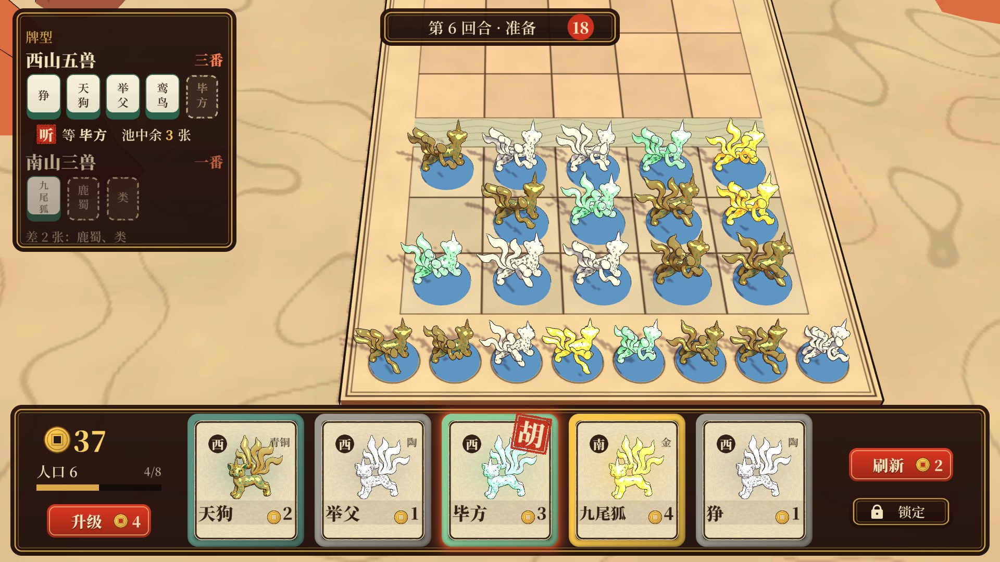
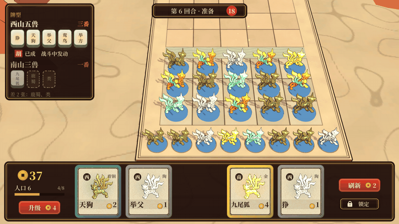

# UI 验证（08 §3）：商店 + 听牌提示 + 胡牌演出

生成：
1. `python tools/ui/make_fonts.py`：生成字体，只需要跑一次。
2. `unity run client -- -executeMethod Automatic.Editor.Batch.UiSlice`
3. `python tools/ui/ui_media.py`：把渲染结果转成这个目录里的图和 GIF。

- 脚本都在 `client/Assets/Editor/`：
  - `UiAssets.cs` 生成贴图、字体和材质。
  - `UiShop.cs` 搭建 UI 层级，存成预制体。
  - `UiCapture.cs` 负责离屏合成和卡面头像。
  - `UiSlice.cs` 负责场景、镜头和演出时间轴。
- 产物在 `client/Assets/HotRes/Ui/`，是热更资源：
  - `ui_shop.prefab` 只用了 UGUI 和 TextMeshPro，没有挂游戏脚本，换 UI 只需要发资源包。
  - 17 张小贴图，全部由程序生成。
  - 两份字体。
- 胡牌演出复用 §1 的棋盘特效。为此把 FxSlice 的时间轴抽成了共用的 `FxTimeline.cs`，UI 和棋盘特效在同一条时间轴上逐帧推进。

**可玩 Demo**：`Relics.exe` 默认进入这段演示，可以自己点。代码在 `client/Assets/HotUpdate/Game/`，`ShopDemo.cs` 管棋盘和时间轴，`HuShowUi.cs` 管 UI 动效，`DemoFraming.cs` 算两个镜头取景。这些代码和编辑器里的 `UiSlice` / `FxTimeline` 用同一组时间常数，改一边要同步改另一边。
- 运行时粒子按真实时间播放，不像编辑器那样逐帧推进，所以每次看到的粒子细节会略有不同。
- 只有「毕方」卡能点。刷新、锁定、升级这些按钮都还没接逻辑。

## 1. 商店 + 听牌（准备阶段）

手机 19.5:9：`shop_phone_19.5x9.jpg`；iPad 4:3：`shop_pad_4x3.jpg`。

| 区域 | 内容 |
|---|---|
| 底部托盘 | 左边是金币、人口、经验条、「升级」；中间 5 张卡；右边是「刷新」「锁定」 |
| 卡面 | 边框颜色和头像材质表示费用档位（陶 / 青铜 / 玉 / 金），右上角另有文字。左上角是阵营字（西 / 南），底部是名字和费用 |
| 左上「牌型」面板 | 正在凑的牌型用**麻将牌**表示：有的是象牙面绿背的牌，缺的是虚线框加淡色名字。下面是状态行 |
| 听牌 | 状态行显示朱印「听」，加上「等 毕方　池中余 3 张」。商店里能胡的那张卡右上角盖一个「胡」印，卡外有朱红光晕呼吸 |
| 未听牌 | 整组半透明，显示「差 2 张：鹿蜀、类」 |
| 顶部 | 回合、阶段、倒计时 |

**屏幕适配**
- 参考分辨率 1920×1080，按 Expand 方式缩放：短边对齐参考尺寸，长边多出来的空间都给棋盘。
- 三种比例用同一份布局，不用单独调。
- 手机两侧多出来的空间留给棋盘。iPad 上方多出来的空间也留给棋盘，能看到对方空着的半场。

**准备阶段的镜头**（2026-10-06 定，04 §2）
- 托盘占了屏幕底部 28%，如果用战斗镜头，己方备战席会被完全挡住。
- 所以准备阶段改用另一个取景：把己方半场和备战席放进 HUD 之外的空白区域。俯角不变，只平移镜头和改距离。
- 切到战斗时再回到整桌镜头，过渡见 §2.1。

## 2. 胡牌演出（买到最后一张）

时间轴 4.4 秒（`hu_sheet.jpg` 是 12 张关键帧）：

| 时间 | UI | 棋盘 |
|---|---|---|
| 0–0.6 s | 能胡的卡呼吸发光 | 准备阶段，全是器物态 |
| 0.6 s | 点下：卡片下沉 | |
| 0.75–1.15 s | 卡片沿弧线飞进牌型面板的空位，空位变成实牌 | 落地时新棋子弹出到棋盘上 |
| 1.35–1.83 s | 面板里的 5 张牌**逐张亮起**，和棋盘上的棋子同步 | §1 的成型特效：光柱，棋子在闪光里从器物换成活体，光点连线 |
| 1.98 s | 「胡」大印从 2.4 倍大小砸下来，画面轻微震动，背后闪一下 | 山海印落地 |
| 2.2–2.5 s | 墨笔横扫出牌型名「西山五兽」，旁边是「三番」 | |
| 3.4–3.8 s | 大印和牌型名缩小，飞回面板，落在原来「听」字的位置 | |
| 3.8 s 起 | 状态行变成朱印「胡」，加上「已成　战斗中发动」 | 成型的棋子待机 |

- 大印放在 HUD 之外的空白区域中央，盖在成型的棋子上方，让「这几只成了」和「胡」在同一个位置被看到。
- 面板里亮牌和棋盘上亮棋子是同一个时刻，从 UI 上就能看出亮的是哪几只。
- 准备阶段的胡牌不占战斗时间轴（06 §2）。
- 只有成型的棋子活过来（04 §6）：演出结束后，这 5 只是活体，其余仍是器物。

### 2.1 开战过渡

接在胡牌演出后面（`start_sheet.jpg` 是关键帧）：

| 时间 | 内容 |
|---|---|
| 4.6 s | 回合条变成「战斗」，商店托盘 0.35 秒内滑出屏幕下方。牌型面板留着，战斗中也能看到哪些牌型已成 |
| 4.75–5.65 s | 镜头保持俯角，从准备取景平滑移到整桌 |
| 5.2 s 起 | 对手的棋子逐排从上方落到格子上，对手已成型的 3 只是活体 |
| 5.9 s | 双方血条出现 |

- 镜头只平移、不转，玩家始终认得出自己的半场，没有晕眩感。
- 16:9 下牌型面板会盖住桌面左边一点空白，不挡棋子。手机和 iPad 没单独验。
- 实现上的坑：编辑器里，缩放过根节点的蒙皮网格在缩放恢复后，蒙皮结果不会更新，所以棋子入场改成从上方落下，而不是从小放大。运行时有 Animator 每帧更新，应该没有这个问题，但没验证。

## 3. 视觉语言（后续 UI 都按这个来）

| 元素 | 规则 |
|---|---|
| 底板 | **漆器**：黑红底，金色细描边，大圆角。在浅色羊皮纸桌面上对比度高 |
| 内容面 | 羊皮纸面，墨线边框。卡面和牌型面板的牌都用这个 |
| 档位 | 只用颜色区分边框：陶是赭红，青铜是铜绿，玉是浅绿，金是金色。边框贴图是白色的，换档位只改颜色 |
| 强调色 | **朱砂**：印章（听 / 胡）、主按钮、番数。整个界面只有它是饱和的红色 |
| 字体 | 思源宋体同源的 Noto Serif SC（OFL 许可）。正文用 600 字重，标题用 900 字重 |
| 图标 | 古物造型，例如方孔钱当金币。线条简单，单色或双色 |
| 动效 | 「盖章」，即放大后砸下、轻震；「墨笔扫出」，即横向填充；「亮牌」，即逐个弹一下 |

**字体**
- 系统里的 Noto Serif SC 是可变字体，默认字重是最细的 200，Unity 读进来会很细。
- `make_fonts.py` 用 fonttools 固定出 600 和 900 两个字重，并只保留 GB2312 的 6763 个常用字、ASCII 和中文标点。每个文件 3.4 MB，走 Git LFS。
- TMP 字体资源是动态的：用到新字时现场生成，所以玩家名之类的文字不用重新打包。

## 4. 结论和待定

**可以确认的**
- 「听牌」的信息够了：等哪张、池里还剩几张、商店里哪张能胡，三处互相对应。
- 「胡」的演出很强烈，远超普通升星的分量，满足 06 §1 的「兑现」要求。
- 漆器加朱砂的配色在三种比例下都清楚，跟桌面不抢。

**问题和待定**
- ~~**准备阶段要不要换镜头**~~：已定换（04 §2），过渡见 §2.1。
- 胡牌卡的朱红光晕偏淡，小屏上可能看不到，正式版要加上卡片轻微上浮。
- 卡面头像都是狰的占位，名字是《西山经》《南山经》里的异兽，牌型数据也只是示例。
- 卡面右上的档位文字（陶 / 玉）和尾巴有一点重叠，以后改到边框上。
- ~~「只有成型的棋子活过来」~~：已定（04 §6），演出和棋盘场景都已按这个改。陶同时改成灰陶，卡框颜色跟着改。

**数据（静态，未实测）**
- UI 一共 124 个元素，其中 50 个是文本。商店预制体 380 KB，大部分是 TMP 存的序列化文本数据。
- 贴图 17 张，编辑器里总共约 1.9 MB，包括 4 张 384² 的头像，还没压缩。字体 2 × 3.4 MB。
- 胡牌演出时棋盘上最多 552 个粒子，跟 §1 一样。
- UI 合批和 overdraw 没测，需要上真机。

**技术说明**
- 真机上 HUD 用 Screen Space Overlay，不受后处理影响。
- 无头截图拍不到 Overlay，所以 `UiCapture` 让 UI 相机先在黑底、再在白底上各渲染一次，两张图的差就是 UI 的透明度，然后在线性空间里合成到带后处理的棋盘画面上。效果和真机一致。
- 卡面头像用同样的方法渲染出透明背景。
- TMP 的 Essential Resources 解压后提交在 `client/Assets/TextMesh Pro/`。`ImportPackage` 在无头模式下是异步的，同一次运行里用不上，所以直接提交。

**成本**
- 全部程序化生成，没有外部费用。
- 正式美术只需要替换贴图和头像，层级、锚点和时间轴都不用改。
