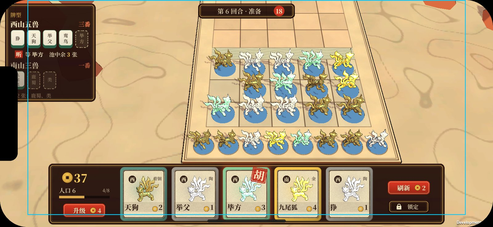
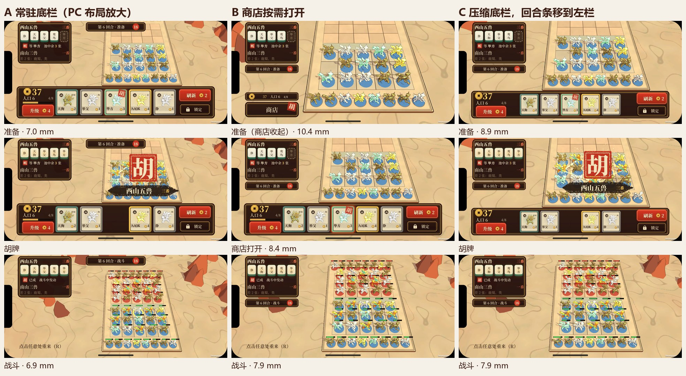

# UI 验证（08 §3）：商店 + 听牌提示 + 胡牌演出

生成：
1. `python tools/ui/make_fonts.py`：生成字体，只需要跑一次。
2. `unity run client -- -executeMethod Automatic.Editor.Batch.UiSlice`
3. `python tools/ui/ui_media.py`：把渲染结果转成这个目录里的图和 GIF。

- 脚本都在 `client/Assets/Editor/`：
  - `UiAssets.cs` 生成贴图、字体和材质。
  - `UiShop.cs` 搭建 UI 层级，存成预制体。
  - `UiCapture.cs` 负责离屏合成和卡面头像。
  - `UiSlice.cs` 负责场景、镜头和演出时间轴。
- 产物在 `client/Assets/HotRes/Ui/`，是热更资源：
  - `ui_shop.prefab` 只用了 UGUI 和 TextMeshPro，没有挂游戏脚本，换 UI 只需要发资源包。
  - 17 张小贴图，全部由程序生成。
  - 两份字体。
- 胡牌演出复用 §1 的棋盘特效。为此把 FxSlice 的时间轴抽成了共用的 `FxTimeline.cs`，UI 和棋盘特效在同一条时间轴上逐帧推进。

**可玩 Demo**：`Relics.exe` 默认进入这段演示，可以自己点。代码在 `client/Assets/HotUpdate/Game/`，`ShopDemo.cs` 管棋盘和时间轴，`HuShowUi.cs` 管 UI 动效，`DemoFraming.cs` 算两个镜头取景。这些代码和编辑器里的 `UiSlice` / `FxTimeline` 用同一组时间常数，改一边要同步改另一边。
- 运行时粒子按真实时间播放，不像编辑器那样逐帧推进，所以每次看到的粒子细节会略有不同。
- 只有「毕方」卡能点。刷新、锁定、升级这些按钮都还没接逻辑。

## 1. 商店 + 听牌（准备阶段）

手机 19.5:9：`shop_phone_19.5x9.jpg`；iPad 4:3：`shop_pad_4x3.jpg`。

| 区域 | 内容 |
|---|---|
| 底部托盘 | 左边是金币、人口、经验条、「升级」；中间 5 张卡；右边是「刷新」「锁定」 |
| 卡面 | 边框颜色和头像材质表示费用档位（陶 / 青铜 / 玉 / 金），右上角另有文字。左上角是阵营字（西 / 南），底部是名字和费用 |
| 左上「牌型」面板 | 正在凑的牌型用**麻将牌**表示：有的是象牙面绿背的牌，缺的是虚线框加淡色名字。下面是状态行 |
| 听牌 | 状态行显示朱印「听」，加上「等 毕方　池中余 3 张」。商店里能胡的那张卡右上角盖一个「胡」印，卡外有朱红光晕呼吸 |
| 未听牌 | 整组半透明，显示「差 2 张：鹿蜀、类」 |
| 顶部 | 回合、阶段、倒计时 |

**屏幕适配**
- 参考分辨率 1920×1080，按 Expand 方式缩放：短边对齐参考尺寸，长边多出来的空间都给棋盘。
- 三种比例用同一份布局，不用单独调。
- 手机两侧多出来的空间留给棋盘。iPad 上方多出来的空间也留给棋盘，能看到对方空着的半场。

**准备阶段的镜头**（2026-10-06 定，04 §2）
- 托盘占了屏幕底部 28%，如果用战斗镜头，己方备战席会被完全挡住。
- 所以准备阶段改用另一个取景：把己方半场和备战席放进 HUD 之外的空白区域。俯角不变，只平移镜头和改距离。
- 切到战斗时再回到整桌镜头，过渡见 §2.1。

## 2. 胡牌演出（买到最后一张）

时间轴 4.4 秒（`hu_sheet.jpg` 是 12 张关键帧）：

| 时间 | UI | 棋盘 |
|---|---|---|
| 0–0.6 s | 能胡的卡呼吸发光 | 准备阶段，全是器物态，各自错相播待机（04 §6：任何阶段都在动） |
| 0.6 s | 点下：卡片下沉 | |
| 0.75–1.15 s | 卡片沿弧线飞进牌型面板的空位，空位变成实牌 | 落地时新棋子弹出到棋盘上 |
| 1.35–1.83 s | 面板里的 5 张牌**逐张亮起**，和棋盘上的棋子同步 | §1 的成型特效：光柱，棋子从待机过渡到「苏醒」，在闪光里从器物换成活体，光点连线 |
| 1.98 s | 「胡」大印从 2.4 倍大小砸下来，画面轻微震动，背后闪一下 | 山海印落地 |
| 2.2–2.5 s | 墨笔横扫出牌型名「西山五兽」，旁边是「三番」 | |
| 3.4–3.8 s | 大印和牌型名缩小，飞回面板，落在原来「听」字的位置 | |
| 3.8 s 起 | 状态行变成朱印「胡」，加上「已成　战斗中发动」 | 成型的棋子待机 |

- 大印放在 HUD 之外的空白区域中央，盖在成型的棋子上方，让「这几只成了」和「胡」在同一个位置被看到。
- 面板里亮牌和棋盘上亮棋子是同一个时刻，从 UI 上就能看出亮的是哪几只。
- 准备阶段的胡牌不占战斗时间轴（06 §2）。
- 只有成型的棋子活过来（04 §6）：演出结束后，这 5 只是活体，其余仍是器物。

### 2.1 开战过渡

接在胡牌演出后面（`start_sheet.jpg` 是关键帧）：

| 时间 | 内容 |
|---|---|
| 4.6 s | 回合条变成「战斗」，商店托盘 0.35 秒内滑出屏幕下方。牌型面板留着，战斗中也能看到哪些牌型已成 |
| 4.75–5.65 s | 镜头保持俯角，从准备取景平滑移到整桌 |
| 5.2 s 起 | 对手的棋子逐排从上方落到格子上，对手已成型的 3 只是活体 |
| 5.9 s | 双方血条出现 |

- 镜头只平移、不转，玩家始终认得出自己的半场，没有晕眩感。
- 16:9 下牌型面板会盖住桌面左边一点空白，不挡棋子。手机和 iPad 也一样（2026-10-07 实测，见 §5）。
- 实现上的坑：编辑器里，缩放过根节点的蒙皮网格在缩放恢复后，蒙皮结果不会更新，所以棋子入场改成从上方落下，而不是从小放大。运行时有 Animator 每帧更新，应该没有这个问题，但没验证。

## 3. 视觉语言（后续 UI 都按这个来）

| 元素 | 规则 |
|---|---|
| 底板 | **漆器**：黑红底，金色细描边，大圆角。在浅色羊皮纸桌面上对比度高 |
| 内容面 | 羊皮纸面，墨线边框。卡面和牌型面板的牌都用这个 |
| 档位 | 只用颜色区分边框：陶是赭红，青铜是铜绿，玉是浅绿，金是金色。边框贴图是白色的，换档位只改颜色 |
| 强调色 | **朱砂**：印章（听 / 胡）、主按钮、番数。整个界面只有它是饱和的红色 |
| 字体 | 思源宋体同源的 Noto Serif SC（OFL 许可）。正文用 600 字重，标题用 900 字重 |
| 图标 | 古物造型，例如方孔钱当金币。线条简单，单色或双色 |
| 动效 | 「盖章」，即放大后砸下、轻震；「墨笔扫出」，即横向填充；「亮牌」，即逐个弹一下 |

**字体**
- 系统里的 Noto Serif SC 是可变字体，默认字重是最细的 200，Unity 读进来会很细。
- `make_fonts.py` 用 fonttools 固定出 600 和 900 两个字重，并只保留 GB2312 的 6763 个常用字、ASCII 和中文标点。每个文件 3.4 MB，走 Git LFS。
- TMP 字体资源是动态的：用到新字时现场生成，所以玩家名之类的文字不用重新打包。

## 4. 结论和待定

**可以确认的**
- 「听牌」的信息够了：等哪张、池里还剩几张、商店里哪张能胡，三处互相对应。
- 「胡」的演出很强烈，远超普通升星的分量，满足 06 §1 的「兑现」要求。
- 漆器加朱砂的配色在三种比例下都清楚，跟桌面不抢。

**问题和待定**
- ~~**准备阶段要不要换镜头**~~：已定换（04 §2），过渡见 §2.1。
- 胡牌卡的朱红光晕偏淡，小屏上可能看不到，正式版要加上卡片轻微上浮。
- 卡面头像都是狰的占位，名字是《西山经》《南山经》里的异兽，牌型数据也只是示例。
- 卡面右上的档位文字（陶 / 玉）和尾巴有一点重叠，以后改到边框上。
- ~~「只有成型的棋子活过来」~~：已定（04 §6），演出和棋盘场景都已按这个改。陶同时改成灰陶，卡框颜色跟着改。

**数据（静态，未实测）**
- UI 一共 124 个元素，其中 50 个是文本。商店预制体 380 KB，大部分是 TMP 存的序列化文本数据。
- 贴图 17 张，编辑器里总共约 1.9 MB，包括 4 张 384² 的头像，还没压缩。字体 2 × 3.4 MB。
- 胡牌演出时棋盘上最多 552 个粒子，跟 §1 一样。
- UI 合批和 overdraw 没测，需要上真机。

**技术说明**
- 真机上 HUD 用 Screen Space Overlay，不受后处理影响。
- 无头截图拍不到 Overlay，所以 `UiCapture` 让 UI 相机先在黑底、再在白底上各渲染一次，两张图的差就是 UI 的透明度，然后在线性空间里合成到带后处理的棋盘画面上。效果和真机一致。
- 卡面头像用同样的方法渲染出透明背景。
- TMP 的 Essential Resources 解压后提交在 `client/Assets/TextMesh Pro/`。`ImportPackage` 在无头模式下是异步的，同一次运行里用不上，所以直接提交。

**成本**
- 全部程序化生成，没有外部费用。
- 正式美术只需要替换贴图和头像，层级、锚点和时间轴都不用改。

## 5. 屏幕比例和手机上的实际尺寸（2026-10-07）

用 Windows 包跑可玩 Demo（`-autoplay`），在 19.5:9、16:9、16:10、4:3 四种比例下截了准备、胡牌、战斗三个时刻。窗口最宽只能开到 1920，所以手机比例用 1560×720 截，再放大到 iPhone 13 的 2532×1170 和 A16 的 2340×1080 看。UI 按参考分辨率缩放，换分辨率布局不变，只是清晰度不同。

**比例本身没问题**：四种比例都没有裁切、错位或重叠，准备和战斗两个取景都正常。16:10 是笔记本和 Mac 的常见比例，这次也补测了。

**手机的问题在实际尺寸**。UI 按短边对齐 1080 缩放，等于把 PC 界面整体缩到手机屏幕上：

| 元素 | 参考尺寸 | iPhone 13 | Galaxy A16 | 参考值 |
|---|---|---|---|---|
| 按钮（升级 / 刷新 / 锁定）高 | 64 | 3.8 mm（23 pt） | 4.2 mm | 触控最小 44 pt ≈ 7.3 mm |
| 商店卡 | 224×256 | 13×15 mm | 15×17 mm | 够 |
| 牌型面板的麻将牌 | 66×88 | 3.9×5.3 mm | 4.4×5.8 mm | 要能点就太小 |
| 正文字号 | 26–30 | 1.6–1.8 mm | 1.7–2.0 mm | iOS 最小 11 pt ≈ 1.8 mm，正文 17 pt ≈ 2.8 mm |
| 最小的字（档位、经验、差几张） | 20–22 | 1.2–1.3 mm | 1.3–1.5 mm | 低于最小值 |
| 战斗时己方格子间距 | — | 约 7.9 mm | 约 8.7 mm | 拖棋子勉强够 |
| 战斗时对方备战席间距 | — | 约 4.5 mm | 约 5 mm | 棋子约 3 mm 宽，档位很难认 |

- 换算：iPhone 13 屏幕短边 64.6 mm（1170 px），A16 约 71 mm（1080 px）。参考尺寸 1 单位在 iPhone 13 上约 0.06 mm。
- 结论：手机要单独的 UI 缩放（约 1.6–1.8 倍才达到触控和字号要求）。放大后托盘（1880 宽）放不下，所以手机要有自己的布局，棋盘可用的空间也会变小，要和「手机取景」（`art/board/README.md`）一起定。

**刘海和圆角**（下图：黑色是 iPhone 13 横屏时的刘海和圆角，蓝框是系统给的安全区，底部是手势条）：

- 刘海盖住了牌型面板左边：「南山三兽」的第一张牌和「差 2 张」那一行。横屏可以朝两个方向，所以左右都要让开。
- 圆角切掉了牌型面板的左上角和右上角的提示文字。
- 底部手势条压在商店卡的下沿，「升级」按钮在安全区外。
- 改法是常规做法：3D 画面铺满全屏，HUD 只放在 `Screen.safeArea` 里。A16 的水滴屏在横屏时 Unity 默认不往刘海区域画，问题比 iPhone 小。

全尺寸截图（准备 / 胡牌 / 战斗，iPhone 13 和 A16 各一套，加安全区示意）在 `artifacts/ratio/phone/`，不提交；传到手机上全屏横看，就是实际大小。

### 5.1 手机布局方案（2026-10-07，待选）

三个方案都在可玩 Demo 里实现了（`PhoneLayout.cs`），上图是模拟 iPhone 13 截的（黑色是刘海和圆角）。共同点：
- UI 按屏幕的实际物理尺寸缩放：参考尺寸 1 单位 = 0.096 mm（正文 2.5 mm，按钮 7.3–7.7 mm 高）。手机靠 `Screen.dpi` 算屏幕短边，短边超过 110 mm 的（iPad、PC）继续用 PC 布局。
- HUD 只放在安全区里，3D 画面铺满全屏。
- 牌型面板放在左上，只完整显示正在听的那组牌，其余牌型各缩成一行。
- 横屏时棋盘的大小由屏幕高度决定，左右有富余，所以三个方案的差别在于底部占多少高度。

己方前排格子在屏幕上的间距（镜头实测，`[Demo] front-row cell`）：

| 方案 | iPhone 13 准备 | iPhone 13 战斗 | A16 准备 | A16 战斗 |
|---|---|---|---|---|
| 现状（PC 布局直接缩小） | 8.3 mm | 7.2 mm | 9.2 mm | 7.9 mm |
| A 常驻底栏（PC 布局放大） | 7.0 | 6.9 | 8.9 | 8.2 |
| B 商店按需打开 | 收起 10.4，打开 8.4 | 7.9 | 收起 13.2，打开 10.3 | 9.2 |
| C 压缩底栏，回合条移到左栏 | 8.9 | 7.9 | 10.8 | 9.2 |

- **A**：结构和 PC 一样，但 UI 放大后棋盘比现状还小。
- **B**：类似金铲铲手机版。商店收起时棋盘最大，每回合买牌要先点「商店」；打开时托盘盖住下方，镜头跟着上移，棋盘变小。商店里有能胡的牌时，按钮上盖「胡」印。
- **C**：商店卡缩到 12×14 mm（仍够点），升级、刷新、锁定按钮保持 7 mm 以上。回合条移到左栏，棋盘不用让出顶部。不需要多点一下。
- 战斗时商店都收起，B 和 C 一样大；A 的回合条在顶部，所以小一点。
- 也试过战斗时把对方备战席裁出画面，格子只大约 7%，不值得，没有保留。

模拟：`Relics.exe -device iphone13|a16 -layout A|B|C`（窗口按手机比例开，如 1560×720）。全尺寸截图在 `artifacts/phone/full/`，不提交。
